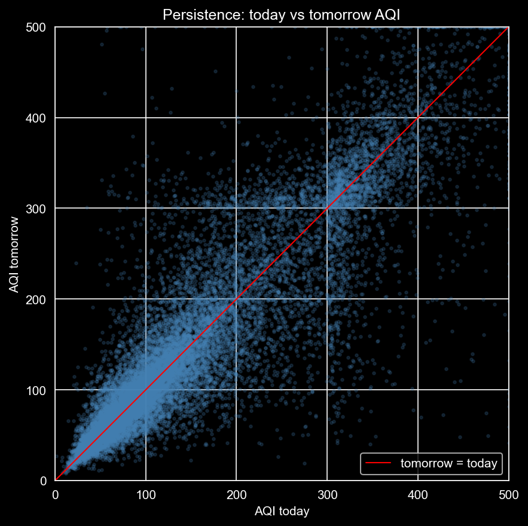
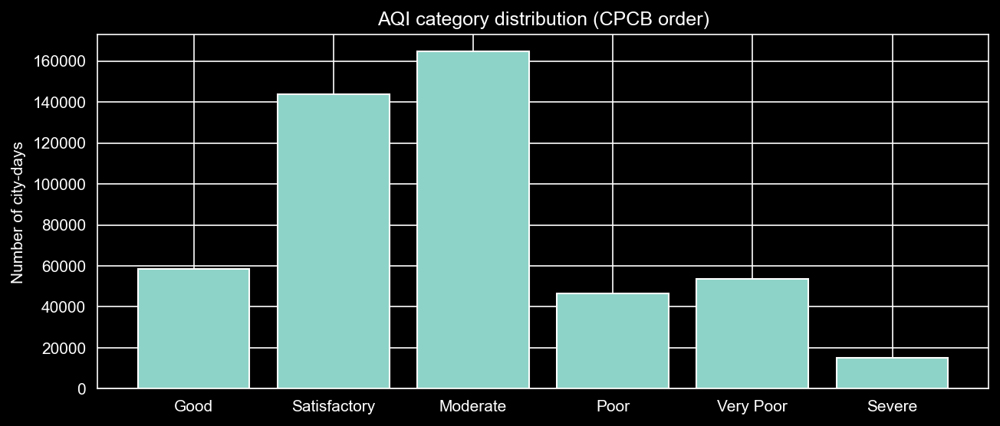
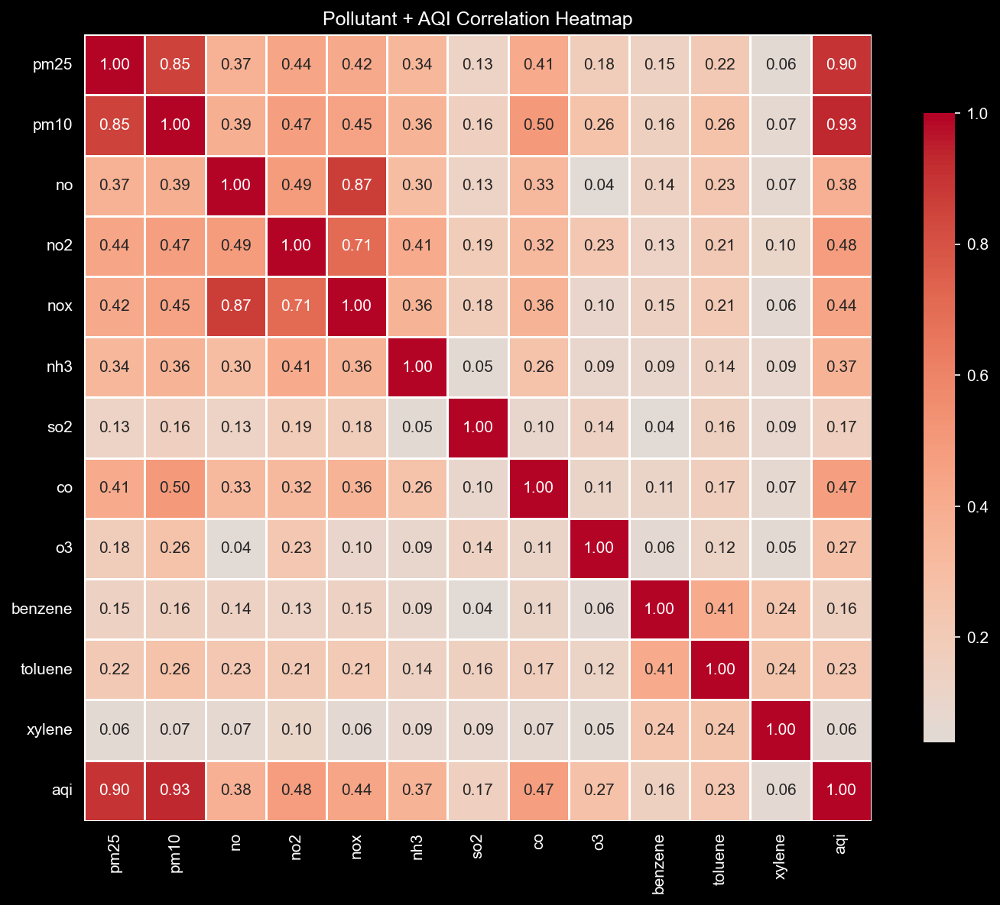
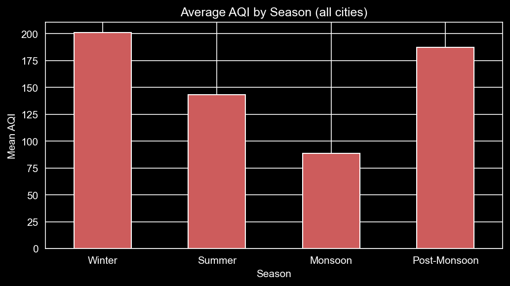

<h1 align="center">📊 AirCast</h1>

<p align="center"><b>Next-day air quality forecasting for Indian cities — built end-to-end from raw CPCB station data.</b></p>

<p align="center">
  <a href="https://aircast-manglam.streamlit.app"></a>
  <a href="https://www.python.org/"></a>
  <a href="LICENSE"></a>
  
</p>

<p align="center">
  
  
  
  
  
  
  
  
  
  
</p>

<p align="center">
  
  
  
  
  
</p>

<p align="center">
  
  
  
  
</p>

<p align="center">
  
</p>

---

## Overview

**AirCast** forecasts **tomorrow's** air quality for **141 Indian cities** — both the numeric AQI value and the official CPCB category (Good → Severe), with a plain-English health advisory. It is built as a full classical-ML engineering pipeline, from 453 raw hourly monitoring-station files all the way to a deployed, interactive web app.

The starting data has **no AQI column at all**. AirCast computes the Central Pollution Control Board (CPCB) AQI itself from pollutant sub-indices, then treats that computed value as the forecasting target — predicting day *T+1* using only information available up to day *T*.

- 🎯 **Beats the persistence baseline** on both regression and classification.
- 🧮 **Computes CPCB AQI from scratch** out of 7 pollutant sub-indices — no pre-labelled target.
- 🕒 **Leakage-safe, time-aware design** — features built per-city after chronological sort; validation via `TimeSeriesSplit`; a strict chronological hold-out test set.
- ⚠️ **Catches the dangerous days** — a class-imbalance strategy lifts *Severe*-class recall from **0.34** to **0.61**.
- 🚀 **Deployed** on Streamlit Community Cloud with an interactive forecast card and 30-day trend chart.

**👉 Try it live: [aircast-manglam.streamlit.app](https://aircast-manglam.streamlit.app)**

---

## Why forecast air quality?

Air pollution is a daily public-health decision, not an abstract number. A parent, an asthmatic, or a school planning outdoor activity doesn't act on "AQI 187" — they act on the *category*: is tomorrow safe, or should the run wait a day? AirCast forecasts both the value **and** the category, because the category is what drives the action. And it forecasts a full day ahead, so the decision can be made in time.

---

## Key results

All figures below are on the **sealed chronological hold-out test set** (train ends `2022-03-31`, test begins `2022-04-01`) — never on data the models saw during training.

### Regression — predicting the numeric AQI

| Model | MAE ↓ | RMSE ↓ | R² ↑ |
|:------|:-----:|:------:|:----:|
| Persistence baseline | 24.008 | 41.404 | 0.745 |
| **Ridge (champion)** | **23.693** | **37.929** | **0.786** |

The linear family beat gradient boosting here — AQI is strongly autocorrelated (today is a great guess for tomorrow), so a well-regularised linear model captures most of the signal, and the honest lesson is that the performance ceiling is set by the data structure, not by hyperparameter tuning.

<p align="center">
  <br>
  <sub><i>Tomorrow's AQI vs today's, across all cities. The tight diagonal (correlation 0.887) is why persistence is a strong baseline — and why a regularised linear model captures most of the signal.</i></sub>
</p>
### Classification — predicting the AQI category

<p align="center">
  <br>
  <sub><i>The imbalance in one picture: <b>Severe</b> is a sliver of all city-days — why accuracy misleads, and why the models are tuned to protect <i>Severe</i> recall.</i></sub>
</p>

| Model | Weighted F1 | Macro F1 | Severe recall ↑ |
|:------|:-----------:|:--------:|:---------------:|
| Persistence baseline | 0.711 | 0.606 | 0.343 |
| LightGBM (balanced) — *all-rounder* | 0.685 | 0.586 | 0.535 |
| Logistic Regression (balanced) — *safety-first* | 0.654 | 0.551 | **0.606** |

> **Reading this honestly:** the baseline's weighted-F1 looks high because it nails the common categories — but it misses roughly **two out of three** *Severe* days, the exact days that matter most for health. *Severe* is only **1.47%** of the data, so accuracy is a misleading score. Applying `class_weight="balanced"` trades a little overall F1 to **nearly double** *Severe* recall. AirCast ships two champions on purpose: LightGBM as the balanced all-rounder, and Logistic Regression when catching hazardous days is the priority.

The confusion matrix on the sealed test set makes the trade-off concrete. Of **213** true *Severe* days, the safety-first model (Logistic Regression, balanced) catches **129** — and, most importantly, mislabels only **15** as outright "safe" (Good / Satisfactory / Moderate).

<details>
<summary><b>Full confusion matrix — Logistic Regression (balanced), test set</b></summary>

<br>

| actual ↓ &nbsp; / &nbsp; predicted → | Good | Satisfactory | Moderate | Poor | Very Poor | Severe |
|:--|--:|--:|--:|--:|--:|--:|
| **Good** | 6780 | 865 | 46 | 6 | 2 | 14 |
| **Satisfactory** | 4126 | 10200 | 1758 | 165 | 21 | 18 |
| **Moderate** | 214 | 3088 | 9426 | 2568 | 309 | 120 |
| **Poor** | 10 | 64 | 714 | 2122 | 744 | 199 |
| **Very Poor** | 10 | 25 | 79 | 691 | 1544 | 453 |
| **Severe** | 5 | 5 | 5 | 29 | 40 | 129 |

</details>

---

## How it works

Every stage is its own single-responsibility class, chained into one leakage-safe pipeline.

```mermaid
flowchart LR
    A["453 CPCB station CSVs<br/>hourly, 2010-2023"] --> B["DataLoader<br/>merge + clean columns"]
    B --> C["DailyAggregator<br/>hourly to daily"]
    C --> D["AQICalculator<br/>compute CPCB AQI + category"]
    D --> E["Cleaner<br/>daily grid reindex + capped fill"]
    E --> F["FeatureBuilder<br/>lags + rolling + calendar"]
    F --> G["ModelTrainer<br/>TimeSeriesSplit bake-off"]
    G --> H["Predictor<br/>Ridge + LightGBM"]
    H --> I["Streamlit app<br/>forecast + category + advisory"]
```



1. **DataLoader** — reads 453 per-station hourly CSVs, joins them to the metadata lookup (station → city, state), and renames raw columns to clean `snake_case`.
2. **DailyAggregator + AQICalculator** — collapses hourly readings to daily means (8-hour max where CPCB requires it), then computes the AQI as the max of 7 pollutant sub-indices, plus its category band.
3. **Cleaner** — collapses multi-station cities to one city-day series, keeps cities with ≥ 730 labelled days, reindexes each city to a **gap-free daily grid**, and applies a 3-day capped forward-fill on predictors only — never on the AQI label.
4. **FeatureBuilder** — builds lag (1/2/3/7-day), rolling mean/std (3/7-day), and calendar/season features **group-wise per city**, so no city ever borrows another city's history.
5. **ModelTrainer** — a `ColumnTransformer` + `Pipeline` that fits all imputation/scaling inside each training fold, cross-validated with `TimeSeriesSplit`, ranking a 9-model regression roster and a 7-model classification roster.
6. **Predictor** — loads the persisted champion pipelines and serves a next-day forecast: value, category, and advisory.

---

## The engineering decisions that matter

- **No leakage, ever.** The forecast for day *T+1* uses only features up to day *T*. Lags and rollings are built per-city after a chronological sort; all scaling and imputation is fit on training folds only, inside the `Pipeline`.
- **Time-aware validation only.** No random shuffling — that would let the model peek at the future. Everything uses `TimeSeriesSplit` plus a single chronological hold-out test set opened exactly once.
- **A baseline before any model.** Naive persistence ("tomorrow ≈ today") sets the falsifiable bar. On autocorrelated air-quality data that bar is *strong*, and every model has to earn its place by beating it.
- **The label is computed before imputation.** AQI is derived from raw measured pollutants, so no imputed guess ever contaminates a training target.
- **Imbalance is treated as a first-class problem.** The rarest category is the most important one, so the whole classification story is built around lifting *Severe* recall, not chasing accuracy.

---

## Tech stack

**Language & core:** Python 3.13 · pandas · NumPy
**Modelling:** scikit-learn · XGBoost · LightGBM · Joblib
**Analysis & viz:** Matplotlib · Seaborn · Plotly · Jupyter
**App & deploy:** Streamlit · Streamlit Community Cloud

Deliberately **out of v1 scope** (reserved as future work): weather features, live APIs, deep learning, and cloud MLOps.

---

## Project structure

```
air_cast/
├── .streamlit/
│   └── config.toml              # dark theme
├── data/
│   ├── raw/                     # 453 station CSVs + metadata  (gitignored)
│   └── processed/
│       └── features.parquet     # model-ready feature table
├── models/
│   ├── ridge_regressor.joblib   # regression champion
│   ├── lgbm_classifier.joblib   # classification champion
│   └── logreg_classifier.joblib # safety-first classifier
├── notebooks/                   # write-after-proof prototyping (01 → 07)
│   ├── 01_eda.ipynb
│   ├── 02_cleaning.ipynb
│   ├── 03_features.ipynb
│   ├── 04_baseline.ipynb
│   ├── 05_regression.ipynb
│   ├── 06_classification.ipynb
│   └── 07_predictor.ipynb
├── src/
│   ├── app/
│   │   └── streamlit_app.py      # the deployed web app
│   ├── data/
│   │   ├── loader.py             # DataLoader
│   │   ├── aggregator.py         # DailyAggregator
│   │   ├── aqi.py                # AQICalculator
│   │   ├── cleaner.py            # Cleaner
│   │   └── build_dataset.py
│   ├── features/
│   │   └── builder.py            # FeatureBuilder
│   ├── models/
│   │   ├── baseline.py           # PersistenceBaseline
│   │   ├── trainer.py            # ModelTrainer
│   │   └── predictor.py          # Predictor
│   └── config.py                 # single source of truth for all constants
├── requirements.txt              # runtime dependencies (what the app needs)
├── requirements-dev.txt          # full dev/training dependencies
└── README.md
```

---

## Run it locally

```bash
# 1. Clone
git clone https://github.com/Manglam11/air_cast.git
cd air_cast

# 2. Create and activate a virtual environment
python -m venv .venv
.venv\Scripts\activate          # Windows
# source .venv/bin/activate     # macOS / Linux

# 3. Install runtime dependencies
pip install -r requirements.txt

# 4. Launch the app
streamlit run src/app/streamlit_app.py
```

The trained models and the feature table are committed, so the app runs immediately. To **reproduce the full training pipeline** from raw data, install `requirements-dev.txt` and download the dataset (below) into `data/raw/`, then run the notebooks in order.

---

## Data

**[Time Series Air Quality Data of India (2010–2023)](https://www.kaggle.com/datasets/abhisheksjha/time-series-air-quality-data-of-india-2010-2023)** by *abhisheksjha* on Kaggle — sourced from India's **Central Pollution Control Board (CPCB)**. It provides hourly readings from **453 monitoring stations** across **241 cities** and **31 states**. AirCast aggregates these to daily city-level series and models the **141 cities** with at least two seasonal cycles of labelled history.

<p align="center">
  <br>
  <sub><i>PM10 (0.93) and PM2.5 (0.90) dominate the AQI signal — the particulate-driven story of Indian urban air quality.</i></sub>
</p>

<p align="center">
  <br>
  <sub><i>Air quality is strongly seasonal — worst in winter, cleanest in the monsoon — which justifies the calendar and season features.</i></sub>
</p>

---

## Limitations & future scope

**v1 is honest about its edges:**
- Forecasts a **single day ahead** (T+1), not a multi-day horizon.
- Uses a real historical day's features as the launch point — there is **no live data feed** in v1.
- **Weather signals** (temperature, humidity, wind) are present in the raw data but deliberately reserved for a later version.

**On the roadmap:** weather-driven features, a live AQI feed, a multi-day forecast horizon, and cloud-based retraining.

---

## Challenges & lessons

- **The data fought back — so the code adapted, not the assumptions.** The source was 453 separate hourly files with no AQI column, not one clean daily table. The fix was a metadata-driven multi-file loader and a decision to compute CPCB AQI ourselves.
- **A silent date-gap trap.** 132 of 141 cities were missing whole calendar dates, which would have let `shift(1)` treat a reading from weeks ago as "yesterday" and quietly corrupt every lag feature. Reindexing each city to a complete daily grid fixed it before it could cause damage.
- **Accuracy is the wrong score for rare, dangerous events.** With *Severe* days at 1.47% of the data, a model can score well while missing the days that matter — visible only through classification and its confusion matrix, never through regression alone.
- **The simplest fix usually wins.** More than once, a "restart and re-run" solved what looked like an architectural bug. Diagnose the cheap cause first.

---

## Connect

<p align="center">
  <a href="https://www.linkedin.com/in/manglam-dubey/"></a>
  <a href="mailto:manglamdubey11@gmail.com"></a>
  <a href="https://personal-portfolio-psi-sooty.vercel.app/"></a>
  <a href="https://github.com/Manglam11"></a>
</p>

---

<p align="center"><i>"All models are wrong, but some are useful."</i><br>— George E. P. Box</p>